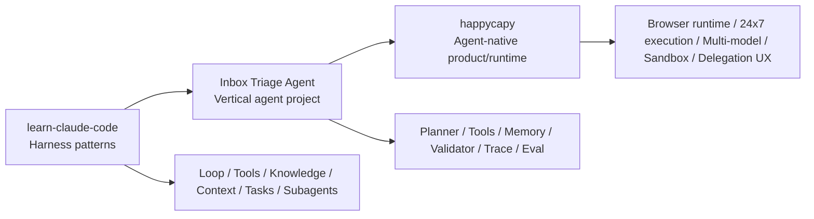

# Inbox Triage Agent：从 learn-claude-code 到 HappyCapy

如果只把 `Inbox Triage Agent` 当成一个本地 demo，它最多只能说明“我会做一个小 Agent 项目”。

但如果把它放进更大的参考系里，它会更像一条完整的路线：

- `learn-claude-code` 解释了 harness 应该怎么想
- `happycapy` 解释了 agent-native product 应该怎么长
- `Inbox Triage Agent` 可以作为中间层练习：从 harness 设计，走向产品化运行时

这篇文章就讲这个映射关系。

## 一句话先说清三者关系

我会把这三个东西放在同一条链路上理解：

```text
learn-claude-code -> Inbox Triage Agent -> happycapy
```

它们分别对应：

- 方法论和教学实现
- 一个垂直场景 Agent 项目
- 更完整的 agent-native computer 产品形态

## 一、learn-claude-code 给了什么

`learn-claude-code` 最有价值的一点，不是“教你怎么调 Claude”，而是把视角从“开发 Agent”切成了“开发 Harness”。

它的核心判断非常明确：

- model 是 agent
- 工程师主要在构建 harness

这个 repo 里最值得拿来吸收的不是某个单点技巧，而是它反复强调的这一组结构：

- one loop
- tools
- planning
- on-demand knowledge loading
- context compression
- task graph
- background execution
- subagents
- team coordination
- worktree isolation

换句话说，它一直在讲：

`不要把心思都花在 prompt plumbing 上，而要把工程能力放在 harness 上。`

## 二、为什么这套思路对 Inbox Triage Agent 有用

因为 `Inbox Triage Agent` 本质上也是 harness 问题，不是“模型够不够聪明”的问题。

在这个项目里，对应关系非常直接：

### 1. one loop

对应我们的主控制循环：

- 读取 ticket
- 决定下一步
- 调一个工具
- 更新状态
- 判断是否结束

### 2. tools

对应我们的 allowlisted tools：

- `lookup_order`
- `lookup_account`
- `search_kb`
- `request_missing_fields`
- `escalate`

### 3. planning

对应 `planner.js`。

Planner 不负责“装得像客服”，而负责下一步动作选择。

### 4. knowledge loading

对应 `MEMORY.md` 和 KB tool。

不是一开始把所有背景资料塞进 prompt，而是需要时再加载相关 policy。

### 5. context management

在这个项目里还只是最小版：

- 显式 state
- facts 分层
- missing field flags
- escalated flag

但这已经是“别把一切混进消息历史”的开始。

### 6. task / trace / eval

虽然项目还没有完整 task graph，但已经有：

- trace
- benchmark
- 明确停止条件

这让它具备了继续往更完整 harness 演化的基础。

## 三、learn-claude-code 最值得借鉴的不是“Claude”，而是分层

我觉得很多人看这个仓库时，容易只盯着两个点：

- Claude Code
- 子 Agent

但真正更值得借鉴的是它的分层意识：

- loop 不变
- 新能力通过 harness 叠加
- 复杂性外移，不塞进主循环

这个思想对 `Inbox Triage Agent` 非常重要。

如果我把所有逻辑直接塞进主循环，最后就会得到：

- 一个很难读的状态机
- 很难调的工具分支
- 很难做 benchmark 的系统

而如果我沿着 harness 的思路拆开：

- loop
- planner
- tools
- memory
- validator
- trace
- eval

那每一层就都能独立进化。

## 四、happycapy 给了什么

如果说 `learn-claude-code` 更像“如何做 harness”的教学样本，那 `happycapy` 更像“agent-native computer 的产品包装”。

从当前页面公开描述里，可以提炼出几个很关键的产品关键词：

- `Turn your browser into an agent native computer`
- `Let AI agents work for you 24/7`
- `Delegate work with Claude Code`
- `powered by 150 plus AI models`
- `secure sandbox environment`

这几个词背后，其实不是 marketing slogan，而是一整套产品层判断。

## 五、HappyCapy 暗示的产品层结构

如果把这些描述翻译成工程语言，大概对应下面这些层：

### 1. 浏览器即运行时入口

这说明产品不只是一个聊天框，而是一个持续可操作的计算环境入口。

### 2. 24/7 agent execution

这意味着系统不再是一次请求一次响应，而是具备：

- 长任务
- 持续运行
- 后台执行
- 状态恢复

### 3. Claude Code delegation

这说明产品不是要替代 agent harness，而是要把现有强 agent runtime 包装进更可用的产品入口。

### 4. 多模型支持

这说明模型层是可替换的，而产品层更关注：

- runtime
- routing
- sandbox
- UX

### 5. secure sandbox

这说明权限边界不是附属品，而是产品能力的一部分。

## 六、Inbox Triage Agent 放在中间层刚刚好

这就是为什么我觉得把 `Inbox Triage Agent` 放在 `learn-claude-code` 和 `happycapy` 中间特别合适。

因为它恰好处在一个很好的中间层：

- 没有轻到只剩 prompt demo
- 也没有重到直接做完整 agent-native computer

它能帮你先练会这些最重要的能力：

- 把 loop 做薄
- 把工具边界收紧
- 把 state 做显式
- 把 memory 分层
- 把 validator 独立出来
- 把 trace 和 eval 建起来

这些东西一旦练熟，再往上走到产品化 runtime，就不会只剩“换个 UI”。

## 七、如果继续往 HappyCapy 的方向演化，要补什么

如果把现在的 `Inbox Triage Agent` 再往 `happycapy` 那种产品形态推，我会优先补下面几层。

### 1. 长任务与后台执行

当前版本还是单 ticket 单运行。

下一步应该支持：

- 后台处理队列
- 工单持续跟踪
- 长任务恢复
- 执行完成通知

这会让它从 demo 更像 runtime。

### 2. 更明确的 sandbox 和 permissions

当前工具边界已经有 allowlist，但还不是真正的权限系统。

下一步可以加：

- 高风险动作审批
- 不同工具不同权限等级
- 外部系统 trust boundary

### 3. 多 agent / 多 worker 形态

比如：

- 一个 agent 负责 ticket 分类
- 一个 agent 负责知识检索
- 一个 agent 负责回复 draft
- 一个 agent 负责风险审查

这会更接近 `learn-claude-code` 后半段讲的 team / delegation 思路。

### 4. 前端工作台

也就是更接近 `happycapy` 里的“agent-native computer”体验：

- ticket queue
- trace viewer
- reviewer approval
- background jobs
- model routing

### 5. 多模型策略

对这个场景来说，最合理的不是“全都用最贵模型”，而是：

- 分类用轻模型
- 高风险判断用强模型
- 生成回复 draft 用中等模型
- validator 用规则 + 模型混合

这时产品层和模型层才真正分开。

## 八、用一张图看三者关系



这张图里，`Inbox Triage Agent` 的位置很关键：

它不是终点，而是练习 harness 思维和产品化思维之间的一座桥。

## 九、如果我要把这个系列再补一篇产品化路线图

我会把下一篇写成这个方向：

`如何把一个垂直 Agent demo，演化成 agent-native product`

结构会是：

1. local loop
2. structured tools
3. persistent state
4. background jobs
5. human review
6. permissions
7. multi-model routing
8. browser workspace / runtime

这样这组文章就会从“会写 Agent demo”，再往前走一步，变成“知道怎么把它推成产品”。

## 十、结论

如果把这三个对象放在一起看，我会这样总结：

- `learn-claude-code` 最适合学 harness engineering
- `Inbox Triage Agent` 最适合做第一个垂直 Agent 项目
- `happycapy` 最适合拿来理解 agent-native product 应该长成什么样

真正有价值的不是单独抄其中任何一个，而是把它们串起来：

- 从 harness 学会分层
- 用垂直项目练会落地
- 再往产品 runtime 推进

这才是一条更完整的 Agent 工程成长路径。

## 参考

- [shareAI-lab/learn-claude-code](https://github.com/shareAI-lab/learn-claude-code)
- [happycapy.ai/app](https://happycapy.ai/app)
