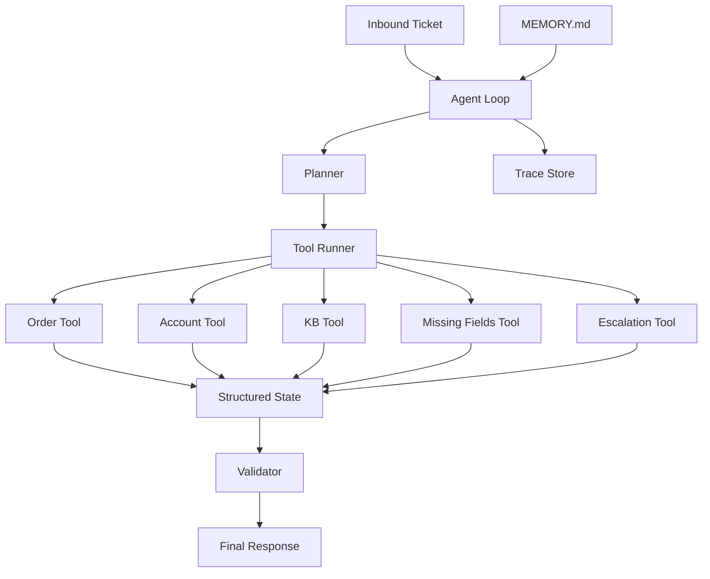

# Inbox Triage Agent：项目总览与架构图

如果只做一个“能写进简历”的 Agent 项目，我会优先推荐 `Inbox Triage Agent`。

一句话介绍：

它读取一条客服或运营工单，判断问题类型和紧急程度，决定要不要查订单、查账号、查知识库、补充信息，最后给出结构化结果、回复草稿，以及是否升级人工。

## 为什么这个题目适合做简历项目

它有三个很现实的优点。

### 1. 业务价值一眼能懂

不需要解释“这个 Agent 有多通用”，因为工单分诊本身就是明确场景：

- 分类
- 查事实
- 生成回复
- 升级人工

### 2. 能完整体现 Agent 工程能力

这个题目天然要求：

- loop
- planner
- tools
- state
- memory
- validator
- trace
- eval

所以它不会退化成一个薄薄的 prompt demo。

### 3. 范围足够小

输入是一条 ticket，输出是一个结构化决策对象。边界很清楚，适合在较短周期内做出完整版本。

## 项目目标

我给这个项目设定的目标是：

1. 输入一条 ticket
2. 判断 category 和 urgency
3. 缺信息时先补信息
4. 需要事实时调用工具
5. 有足够证据时输出 grounded response
6. 风险高时升级人工
7. 记录 trace 并接入 eval

## 整体架构图



这张图最值得注意的不是“模块很多”，而是职责分离：

- `Planner` 决定下一步动作
- `Tool Runner` 执行 allowlisted tools
- `State` 显式保存事实和流程状态
- `Validator` 决定输出能不能放行
- `Trace` 负责复盘，不和主逻辑耦合

## 为什么这个架构比“一个大 prompt”更稳

因为它把复杂性拆开了。

如果什么都塞进 prompt，后面会遇到几个问题：

- 状态越来越隐式
- 工具选择越来越难调
- 错误很难定位
- benchmark 很难建立

而拆成 loop + tools + state + validator 之后，问题会变成可诊断的工程问题。

## 输出长什么样

最终结果不是一段自由文本，而是一个结构化对象：

```json
{
  "ticketId": "DEMO-1",
  "category": "order_status",
  "urgency": "medium",
  "escalated": false,
  "recommendedAction": "share_status_and_next_step"
}
```

然后在这个结构化输出旁边，再配一个 grounded 的回复草稿。

这背后的工程判断是：

- 机器优先返回可处理的数据结构
- 人类再消费可读文本

## 一个典型 case

例如：

```text
The monitor never arrived and this is blocking our launch. Order ORD-1003.
```

典型路径会是：

1. 分类为 `order_status`
2. 紧急程度识别为 `high`
3. 调用 `lookup_order`
4. 得到订单状态 `lost`
5. 调用 `search_kb`
6. 命中高优先级/VIP 场景
7. 触发人工升级

## 这篇文章之后该看什么

如果总览已经清楚，下一篇最值得看的就是控制流本身：

- [Inbox Triage Agent：Loop 与 Planner 设计](/posts/inbox-triage-agent-loop-planner)
