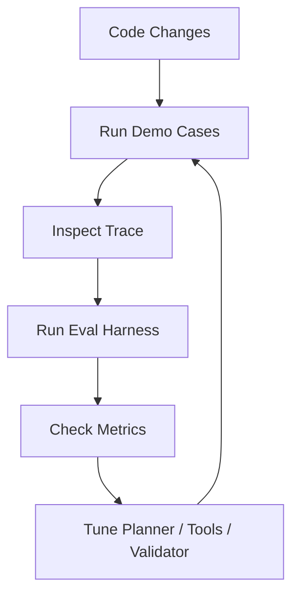

# Inbox Triage Agent：Trace、Eval 与工程闭环

如果一个 Agent 项目没有 trace 和 eval，它很容易停留在“能跑 demo”的阶段，很难进入“能稳定迭代”的阶段。

这一篇专门讲两个东西：

- trace
- evaluation harness

## Trace 为什么不是可选项

很多人把 trace 当成排障日志，但我更倾向于把它当作 Agent 的基础设施。

每次运行，至少应该记录：

- planner decision
- tool result
- validator result
- final output

这样当结果不对时，你才能判断到底是哪一层出了问题。

## 一个精简版 trace

```json
[
  { "kind": "memory_loaded" },
  {
    "kind": "planner_decision",
    "step": 1,
    "action": { "type": "state_update" }
  },
  {
    "kind": "tool_result",
    "step": 2,
    "tool": "lookup_order"
  },
  {
    "kind": "tool_result",
    "step": 3,
    "tool": "search_kb"
  },
  {
    "kind": "validator",
    "step": 4,
    "validation": { "ok": true }
  }
]
```

这类结构化 trace 后续非常容易扩成：

- replay
- 错误聚类
- 在线采样分析
- 调试 UI

## Eval harness 应该怎么想

评测不是为了证明系统“很厉害”，而是为了让系统每次改动都能被衡量。

在这个项目里，我先准备了一组 toy benchmark，覆盖：

- 延迟订单
- 密码重置
- VIP 丢件
- 损坏退款
- 缺少 order id 的退款请求

然后统一看几个指标：

- category accuracy
- urgency accuracy
- escalation accuracy
- completion rate

## 当前评测结果

当前小数据集结果是：

```json
{
  "total": 5,
  "categoryAccuracy": 100,
  "urgencyAccuracy": 100,
  "escalationAccuracy": 100,
  "completionRate": 100
}
```

这个结果不代表系统已经强到能上线，它只代表系统已经有了一个最小可重复的工程回路。

## 为什么“先有 eval，再调系统”很重要

没有 eval 的时候，你很容易陷入一种错觉：

- 改了一段 prompt
- 看了两个案例
- 感觉结果更好了

但这种“感觉”是没法积累的。

而有了 benchmark 之后，每次改动都能转成具体问题：

- category 是变好了还是变差了
- urgency 有没有回归
- escalation 有没有误伤
- completion rate 有没有下降

## 工程闭环图



这张图的核心意义是：

系统优化不再靠直觉，而是靠 trace 和指标驱动。

## 真实案例怎么复盘

如果一个高风险退款没有被升级人工，你就可以沿着这个链路查：

1. planner 有没有识别出 refund_request
2. 有没有命中缺失字段分支
3. 有没有正确读取 memory/policy
4. confidence 是不是估低了风险
5. validator 有没有放过不该放的输出

这时 trace 才是真正有用的。

## 这一层最常见的坑

### 1. 只有最终输出，没有中间过程

这会让问题几乎无法归因。

### 2. 只做 demo，不做 benchmark

系统看起来能跑，但改动之后很容易悄悄退化。

### 3. 指标太花，不够聚焦

一开始只看最关键的几个就够了：

- 正确分类
- 正确升级
- 正确完成

## 这个系列的终点

到这里，这个项目的关键层就都拆开了：

- [项目总览与架构图](/posts/inbox-triage-agent-overview)
- [Loop 与 Planner 设计](/posts/inbox-triage-agent-loop-planner)
- [Tools、Memory 与 Validator](/posts/inbox-triage-agent-tools-memory-validator)
- [Trace、Eval 与工程闭环](/posts/inbox-triage-agent-trace-eval)

如果后面继续扩，我会优先补：

- LLM planner 的结构化输出
- 更真实的数据集
- human-in-the-loop 审核页面
- 更严格的 groundedness 校验
